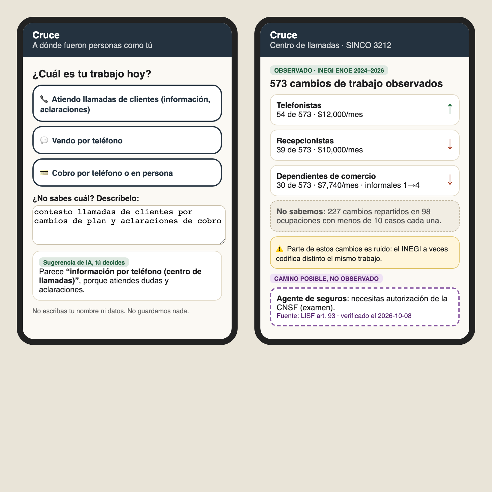
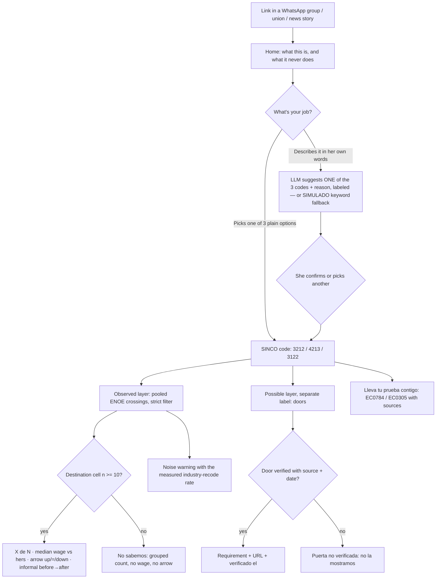
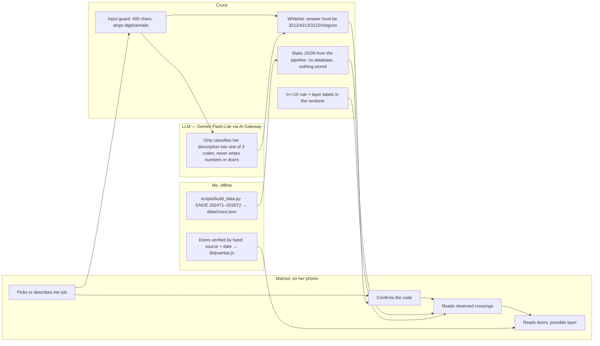

# Packet — w09-cruce · "Cruce: a dónde fueron personas como tú"

> Written BEFORE the code (course discipline). Week 9 · Chapter 8 "The Job Savior" · T3 · TECHNOLOGIST lens · Andrés Álvarez Morphy Namnum.
> **T3 Blueprint: pending.** The Team Bending session hasn't happened as I write this. The course allows building "the fused idea or their own surviving idea," and this slice is the one that survived 12 rounds in my brief (section 4, SECOND-RUNG). When the Blueprint exists, the "Conditions → build" table gets re-checked against its conditions.

## The problem, in my words

AI is eating the formal entry jobs in Mexico (admin, reception, data capture, call centers). According to México ¿cómo vamos? (ENOE × ILO-NASK), 2.93M jobs are in medium/high generative-AI exposure, and the most exposed are exactly the jobs that were the **door into formality**. izzi/Sky already cut ~980 jobs, mostly in call centers, and its CEO called 2026 "el año en que pasaremos de un teléfono típico a un operador telefónico basado en IA."

The call-center agent carries real skill (Lee's "empathy," the week's "stardust"), but **nothing in Mexico records where people like them go next**. The reallocator in the chapter lies to Elsa. In Mexico, nobody even tells her.

**What my fight found (tests I ran, logs in `w09-fight/tests/`):**
- An async "first proof" doesn't survive today's models: 5 of 5 Claude runs passed my Week-4 work sample in 15–68 s, 2 of them with a false legal rule. So I moved to the **crossing**, not the proof.
- INEGI's ENOE is a rotating panel (the same household is interviewed for 5 quarters), so you can **observe** real Mexicans moving from SINCO 3212 (call center) to another code. One quarter-pair gave 86 strict movers, and only 1 destination cleared n≥10, and it pointed **down** (shop clerk, MX$6,880 vs MX$8,000).
- Part of the "movement" is **INEGI coder noise**: the same job coded differently from one quarter to the next. That has to be on the screen, not in a footnote.

## Exact user

- **"Marisol Treviño,"** 41, an agent at a telecom's call center in Monterrey for 9 years (billing and plan changes). She heard about the AI phone operator from her supervisor. She uses WhatsApp and Facebook all day, reads fine but gets tired with long text, and distrusts anything that "asks for her data." She has a preparatoria education. *(Invented persona, built from the week's research; not a real person.)*
- What she wants to know: **"Si me corren, ¿a dónde se van las que son como yo? ¿Les va mejor o peor?"**
- She's not a client of anyone. Nobody sends her here: she finds it by link (a WhatsApp group of coworkers, a union, a news story).

## Definition of success

**Before the module closes**, at the live URL, with no account and nothing stored about her:
1. On `/`, she picks her job among 3 plain-language options (call-center information, televentas, cobranza), **or** describes it in her own words and the **LLM suggests** one of the 3 codes with a short reason (labeled "Sugerencia de IA, tú decides"; deterministic keyword fallback labeled SIMULADO if the model is unavailable).
2. On `/mapa/[clave]`, the **observed layer**: real ENOE crossings pooled over 9 quarter-pairs (2024 T1 → 2026 T2), strict filter (occupation AND industry changed). Each destination with **n ≥ 10** shows "X de N cambios," its median wage vs her origin's, an arrow ↑ / = / ↓ against her code's median, and informality before → after. Everything below 10 is grouped as **"No sabemos: N cambios repartidos en K ocupaciones."**
3. On the same screen, a **noise warning** with the real number: "X% de quienes se quedaron en su misma ocupación cambiaron de clave de industria," so part of these crossings is coding noise.
4. On the same screen, separated and labeled **"Camino posible, no observado,"** the **doors**: for each destination with a verified requirement or certification, the requirement, its source URL and "verificado el 2026-10-08." Unverified destinations say "Puerta no verificada: no la mostramos."
5. **"Lleva tu prueba contigo"**: the CONOCER standards that certify what she already does (EC0784 Atención al cliente vía telefónica; EC0305), with sources. These are live, human-observed proofs, the format my tests said survives the models.
6. `/metodo` explains the data, filters, thresholds, noise and what the tool refuses to do.

## Mockup (generated)

*Generated by code (HTML → Playwright) before writing the app, as in weeks 4–8: the class19 team's free AI Gateway doesn't give access to image generation.*

## Flow

## Benchmark

**The best existing solution in the world for this is** Nesta's **Mapping Career Causeways** (UK, open source): ESCO skill similarity plus crowd feasibility ratings, used to recommend "safe and desirable" transitions for at-risk workers, with customer service and clerks flagged as most at risk. **Mine differs/localizes in that** Mexico has no SINCO↔ESCO crosswalk and no crowd ratings, so instead of *possible* transitions inferred from skills, Cruce shows **observed** Mexican transitions from INEGI's own panel, with the coding noise measured, informality before and after, and a hard n≥10 rule. It recommends nothing; it shows where people went, and the possible paths live on a separate, labeled layer.

## Long view (3 sentences)

See `CHARTER.md`. In short: in three years, the public crossing map for every AI-exposed occupation, pooled ENOE plus IMSS, with the noise published. Every door links to a live-observed state proof (CONOCER) the worker can carry. The walls never move: no hidden fall, no human scored, no door without a source.

## Scope cut (what I'm NOT building this week)

- **No vacancies, no employer side, no profile.** That's the forbidden zone (job board / CV builder) and a design decision.
- **No skill-similarity "possible" map** (embeddings). The possible layer this week is only verified doors, and the mixing of layers is what the shadow clause forbids.
- **No individual metrics** (the ARCO/recontact idea from the fight was dropped as a hidden score).
- **No other origin codes** beyond 3212, 4213, 3122. The pipeline supports more, but the doors are verified by hand.
- **No noise correction model.** The noise is measured and shown, not corrected.
- **No account, no database, no stored input.** The LLM classification is stateless.

## Conditions → how the build honors them

*T3 Blueprint pending. Meanwhile, these are the conditions from my brief (sections 4–6) and the fight.*

| Condition (brief / fight) | How |
|---|---|
| 1. Never hides the fall (shadow clause) | Arrow ↓ shown in the same style as ↑; destinations sorted by count, not by wage; informality before→after on every cell. |
| 2. "Where people like you went," never "where you should go" | No ranking by wage, no "recommended," no score. Copy reviewed for imperatives. |
| 3. n < 10 → "No sabemos" | The pipeline never emits a cell under 10 individually (grouped into "otros"); the renderer has a second guard. |
| 4. Observed and possible never share credibility | Two visually distinct sections with different labels; doors never show counts or wages. |
| 5. No door without source + date; the LLM never writes a door | Doors are a static file (`lib/puertas.js`) with `fuente` and `verificado` required; a unit test fails the build otherwise. |
| 6. No human scored | No input besides the job description; nothing stored; no output about her. |
| 7. Not a job board | No vacancy, employer or contact field anywhere in the data model. |

## Dragon stack (multiplies, doesn't add)

**LLM** (classifies a free-text job description into one SINCO origin code; Gemini Flash-Lite via AI Gateway; deterministic keyword fallback labeled SIMULADO) × **structured/verified data** (INEGI ENOE microdata, 10 quarters, 9 linked quarter-pairs, strict filter, n≥10; SINCO 2019; doors verified against LISF art. 93, CNSF Circular S-1.14, CONOCER EC0784/EC0254/EC0305) × **matching logic** (person→code matching with a whitelist; panel linkage across quarters by the ENOE household/person key; the n≥10 + layer rules). The LLM gets her to the right code without her knowing what SINCO is. The data makes the map real. The matching logic keeps the LLM from inventing anything. Take the data away and the LLM is a horoscope. Take the LLM away and Marisol has to know her SINCO code.

## Architecture and stack

| Layer | Choice | Why |
|---|---|---|
| Framework | Next.js 15 (App Router, JS) + Tailwind 4 | course template |
| Data pipeline | `scripts/build_data.py` (pandas) → `data/cruce.json` | reproducible; raw microdata never deployed |
| Doors | `lib/puertas.js`: static, each with `fuente` + `verificado` | the LLM never writes a door |
| Rules | `lib/reglas.js`: n≥10, arrow thresholds (±5% vs origin median), layer labels | testable, one place |
| LLM | AI SDK + Vercel AI Gateway → `google/gemini-2.5-flash-lite` (class19 free tier; Anthropic returns 403, tested 2026-10-01); output validated against a whitelist; SIMULADO fallback | free; can't invent codes |
| Persistence | none | nothing personal → no auth needed |
| Headers | CSP self-only, no-referrer, DENY, Permissions-Policy, HSTS | security floor |
| Hosting | Vercel (team class19) | |

## Security floor

1. **Secrets:** none in the repo; AI Gateway auth through Vercel OIDC in production; `.env*` in `.gitignore`. 2. **Auth:** doesn't apply; nothing personal is stored, and `/metodo` says so. 3. **RLS:** doesn't apply (no database). 4. **Validation:** `/api/clasificar` accepts only `{descripcion}`, a string of 10–400 characters; digits and emails are stripped before the prompt; the response must be one of `3212|4213|3122|ninguno`; per-IP rate limit. 5. **Invented data:** the persona is invented and labeled; the map data is aggregated public INEGI microdata with no cell under 10.

## Test plan

**Mechanical** (`node --test` over `lib/` + Playwright against production at 390 px):
- a) `celda()`: n=9 → "No sabemos," no wage; n=10 → shown.
- b) `flecha()`: destination median 5% below origin → ↓; within ±5% → =.
- c) Every door has `fuente` (https URL) and `verificado` (ISO date); a door without them fails the test.
- d) `normalizarClasificacion()`: rejects anything outside the whitelist; `limpiar()` strips digits/emails and caps at 400.
- e) The pipeline never emits a destination with n < 10 (checked against `data/cruce.json`).
- f) E2E: home → pick 3212 → map shows the noise box, at least one ↓, the "No sabemos" group, the possible layer label, and no "recomendado / deberías" text.
- g) E2E: free text → classification (real or SIMULADO, labeled) → confirm → map.
- h) Security headers present.

**Persona test (Layer 1):** a fresh agent plays Marisol Treviño, walks the screenshots of the live URL in order, narrates hesitation and where she'd quit; log every confusion, fix the worst, redeploy.
